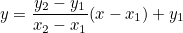

## Guruarth Coding Challenge 4

## Bob Navigates a Maze

- This problem is a variant of Traveling salesman problem. Used bitmask dp to solve it here.

- First, compute the shortest distance from each gold node (including the source node) to all other node.

    - Used bfs to calculate the shortest distance from a gold node to all other nodes.
    - Then stored it in a 3d array where first 2 indexes are the location of a node, and the last index is the index of the gold node in an array where we are storing the location of the gold node.
    - Then find the smallest distance from the subset of all gold nodes. That means we can go from `A -> B -> C -> D` or `B -> C -> A -> D` etc, where A,B,C,D are gold nodes. We have to take the set from all these subsets which gives us the minimum path.
    - Have used bitmask dp to compute all the subset for a gold node and took the minimum form it.

## Paint The Ceiling
- First, Pre-computed all the sides available in an array using the given equation.
- We can see from the equation that the values will be sorted. So we can run binary search.
- We don't have to iterate the whole array. We just have to iterate it till the square root of the given area, Because after that all will be repeated.
- In each iteration we searched for the closest value of `area/current_side` If we find the closest value which is less than or equal to it in the array, we have added `2*(found_value_position - sqrt_of_area_postion)` with the count.

## VM Pricing
- It is a straight forward linear interpolation problem.
- Considering all the conditions in the problem statement, Just used the line equation of two points to find the required point:

    
    , Where `(x1, y1)` and `(x2, y2)` is the price and quantity of two different dates, `x` is given quantity and `y` is the required price.
